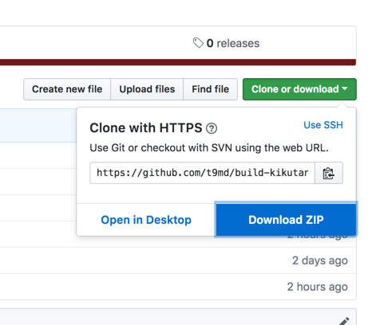
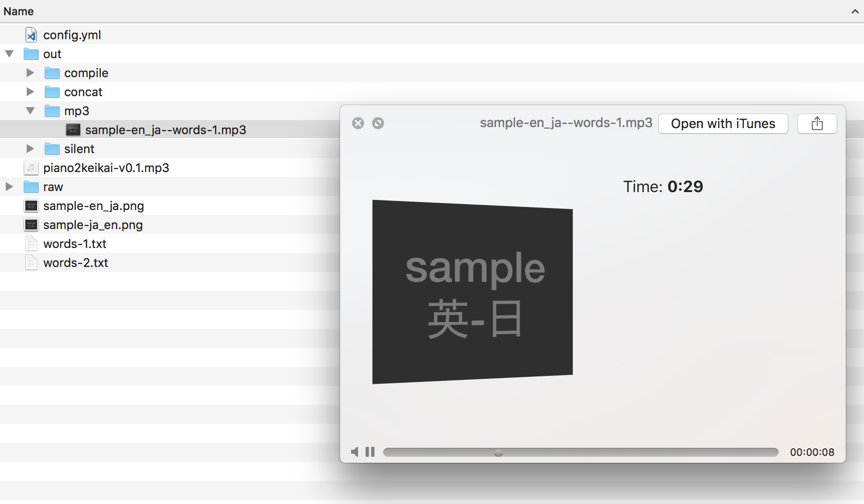

<!-- TOC START min:1 max:3 link:true update:true -->
- [build-kikutan](#build-kikutan)
- [これは何?](#これは何)
  - [出来ること](#出来ること)
    - [cram-vocabulary との連携](#cram-vocabulary-との連携)
  - [対象環境](#対象環境)
  - [対象者: どれくらいの技術知識、スキルが要るか？](#対象者-どれくらいの技術知識スキルが要るか)
- [セットアップ:事前準備](#セットアップ事前準備)
  - [関連ツールのインストール](#関連ツールのインストール)
  - [Google TTSを使えるようにする](#google-ttsを使えるようにする)
  - [build-kikutan をダウンロードして好きなフォルダに展開](#build-kikutan-をダウンロードして好きなフォルダに展開)
- [使い方](#使い方)
  - [サンプルを使って実際に作ってみよう。](#サンプルを使って実際に作ってみよう)
  - [何が起こった？](#何が起こった)
  - [バックグラウンド・ミュージック合成 + アルバムジャケット](#バックグラウンドミュージック合成--アルバムジャケット)
  - [日本語の読み上げが微妙な部分をマシにする。](#日本語の読み上げが微妙な部分をマシにする)
    - [問題-1: `〜に沿って` が "チルダにそって"と読み上げられる](#問題-1-に沿って-が-チルダにそってと読み上げられる)
    - [問題-2: `ゴマの実` が "ごまのじつ" と読み上げられる](#問題-2-ゴマの実-が-ごまのじつ-と読み上げられる)
  - [別の曲をつくってみよう。今後は日本語 → 英語の順で。](#別の曲をつくってみよう今後は日本語--英語の順で)
    - [別のソース・ファイル `words-2.txt` からも作ってみよう](#別のソースファイル-words-2txt-からも作ってみよう)
  - [今後に向けて。。。](#今後に向けて)
- [Sox の操作あれこれ](#sox-の操作あれこれ)
  - [音を小さくする: `music.mp3` の音量を `0.1`倍にする。バックグラウンドミュージックとしてはこれぐらいが良かった。](#音を小さくする-musicmp3-の音量を-01倍にするバックグラウンドミュージックとしてはこれぐらいが良かった)
  - [曲の長さとかを見る](#曲の長さとかを見る)
    - [曲をループさせて長くする。](#曲をループさせて長くする)
- [FAQ](#faq)
  - [Google TTSは無料？お金かかる？](#google-ttsは無料お金かかる)
  - [なぜ Ruby gem にしない？(技術的な想定される質問)](#なぜ-ruby-gem-にしない技術的な想定される質問)
  - [音声ファイルのサイズが大きいんですが。。もうちょっと小さくなりませんか？](#音声ファイルのサイズが大きいんですがもうちょっと小さくなりませんか)
  - [Movie も生成できる？](#movie-も生成できる)
  - [Movie はどうやったら生成できる？](#movie-はどうやったら生成できる)
  - [SSML はサポートしてますか？](#ssml-はサポートしてますか)
  - [Movie 用と音声用で、src ファイルが若干ちがうのですが。。](#movie-用と音声用でsrc-ファイルが若干ちがうのですが)
  - [cram-vocabulary 用の音声インストールの方法は？](#cram-vocabulary-用の音声インストールの方法は)
  - [ディスク容量はどれくらい必要ですか？](#ディスク容量はどれくらい必要ですか)
- [謝辞](#謝辞)

<!-- TOC END -->


# build-kikutan

# これは何?

"キクタン"シリーズの様な単語学習アルバムを自力で作成することが出来るツール。  

[このツールで生成したじぶんキクタン@SoundCloud](https://soundcloud.com/t9md/sample-en-ja-words-1)  
また [t9md/cram-vocabulary](https://github.com/t9md/cram-vocabulary) と組み合わせることで、movie も生成可能。  

以下の様な テキストがあるとします。

```
abbey	修道院、大寺院
aberration	常軌を逸すること
abet	けしかける、教唆する
abiding	変わることのない
```

このツールを使うと、このテキストを音声化し、好きな音楽をバックグラウンドミュージックとミックスしたアルバムを作れます。
iPhone 等で聴くことが出来るので、ジョギングや、家事をしながらボキャビルが出来るようになるんです！やった！  

## 出来ること

- テキストから音声合成. Google の [CLOUD TEXT-TO-SPEECH](https://cloud.google.com/text-to-speech/) を使用。
- 音声を決めたルールに従って結合. "英-日" や "日-英". 結合時の無音部分も指定可能 `rule: [en, 1.0, ja, 1.0]` みたいに。
- 一行ごとに生成された音声を一つの音声にまとめて、曲名、アルバム名、ジャケット、アーティスト名、歌詞に単語リストを設定.


### [cram-vocabulary](https://github.com/t9md/cram-vocabulary) との連携

- 単語学習動画生成: cram-vocabulary のHTMLページをキャプチャし、動画化する。
- cram-volabulary用の音声生成: build-kikutan が音声を生成し、cram-vocabulary の sounds/ 配下にインストール

## 対象環境

- Mac で使用する事を前提にしている。
- Linux でもいけるはず。
- Windows では難しいと思う。

## 対象者: どれくらいの技術知識、スキルが要るか？

- コマンドラインインターフェイスなので、ターミナル操作が出来る必要あり。
- ffmpeg や、SoX コマンドを内部で使用しているので自力で入れる必要あり。

# セットアップ:事前準備

## 関連ツールのインストール

Ruby のタスク管理ツール `Rakefile` として実装している。
以下を自力でインストールして下さい。※ 他にもあるかも。。あったら教えて。。

- `ffmpeg`: wav から mp3への変換で使用
- `sox`: 音声結合で使用
- `eyeD`: 曲名、歌詞設定等で使用
- `rake`: `rake` コマンドは Ruby のタスク管理ツール。最近の macOS はデフォルトで使えるので基本インストールは不要。

```sh
brew install ffmpeg
brew install sox
pip install eyeD3
```

- `google-cloud-text_to_speech` の gem (Ruby のライブラリ)

```
$ gem install google-cloud-text_to_speech
```

↑ が入らなければ ↓ を try

```
$ sudo gem install google-cloud-text_to_speech
```

## Google TTSを使えるようにする

- Google Cloud のアカウント作成とTTSのAPIの有効化。API key をどこかに保存
- Shell から `echo $GOOGLE_APPLICATION_CREDENTIALS` としてJSON が出力されればOK
- やり方を説明してあるページもたくさんあるし、Google TTSのホームページから指示に従ってやればで出来るはず

## build-kikutan をダウンロードして好きなフォルダに展開



このページの右上の "Clone or download" から zip をダウンロード。好きなフォルダに展開する。

# 使い方

## サンプルを使って実際に作ってみよう。

build-kikutan の中には `sample` 配下にサンプルプロジェクトを用意してある。  
これを使用して、実際にキクタン的なアルバムを作成していく。  
入門から応用まで説明するので、これをやりきれば余裕でオリジナル・キクタンを作れるようになるはずだ。  
長いけど頑張って！  

作業は殆ど、ターミナルから行う。  
ターミナルを開いて build-kikutan を展開したフォルダに移動しよう。  

`src/sample` がサンプルプロジェクトだ。必要なファイルが一式揃っている。  
各ファイルの役割は以下の通り。   

```
src/sample
├── config.yml             # 設定ファイル
├── piano2keikai-v0.1.mp3  # mix する音楽ファイル.
├── sample-en_ja.png       # アルバムジャケット en_ja 用(英-日の順序)
├── sample-ja_en.png       # アルバムジャケット ja_en 用(日-英の順序)
├── words-1.txt            # 単語リスト-1
└── words-2.txt            # 単語リスト-2
```

早速やってみよう。  
作業は `rake` というコマンドを使って進めていく。  
以下のコマンドをターミナルから実行しよう。  

```
$ rake conf=src/sample/config.yml src=src/sample/words-1.txt -T
```

- コマンドは全て build-kikutan 直下のディレクトリ(`Rakefile` があるディレクトリ)で行って下さい。説明の単純化の為です。
- `conf` と、`src` は常に指定する必要がある。それぞれ、設定ファイル `config.yml` と単語リスト-1(`words-1.txt`) を指定している。
- `rake` の `-T` オプションでタスクの一覧が見られる。

以下が実行結果

```
$ rake conf=src/sample/config.yml src=src/sample/words-1.txt -T
(in /Users/t9md/github/build-kikutan)
rake clean                       # clean: Clean all files except 'raw' directory
rake en_ja:album                 # album
rake en_ja:album:play            # play
rake en_ja:compile               # compile
rake en_ja:compile:play          # play
rake en_ja:concat                # concat
rake en_ja:concat:play[line]     # play
rake en_ja:debug                 # debug
rake en_ja:itunes                # itunes
rake en_ja:mp3                   # mp3
rake en_ja:mp3:play              # play
rake en_ja:raw                   # raw
rake en_ja:raw:play[line,field]  # play
```

- 基本ルールとして、`en_ja:album` は `en_ja:album` を作成する。
- `en_ja:album:play` とすると作成したファイルを即座に再生する。  
- 作ったものをすぐに再生したければ `:play` を末尾につける、と覚えておけば良い。  

それでは、早速作ってみよう。  

```
$ rake conf=src/sample/config.yml src=src/sample/words-1.txt en_ja:album
```

できた。  
設定ファイルがあるディレクトリの直下に `out`, `raw` のディレクトリが作られ、そこに幾つかファイルが生成されている。  

`open` コマンドで `out` ディレクトリを Finder で開いてみてみよう。

```
$ open src/sample/out
```

`mp3` ディレクトリ直下にある `sample-en_ja--words-1.mp3` が最終的に出来たものだ。  
スペースキーを押して Quick Look で再生してみよう。(※ ダブルクリックすると iTunes に取り込まれて再生されるので、あとで消すのが面倒なので )

## 何が起こった？

1. 設定ファイル(`conf`)と指定された単語リスト(`src`) からGoogleで音声化
2. できた音声ファイルを１行毎に `en`, `ja` の順で結合し、全部を一つの曲にまとめて
3. バックグラウンドミュージックを mix し、アルバムジャケットを設定した

渡した単語リスト(`src=src/sample/words-1.txt`)はコレ

- words-1.txt
```txt
Hello	こんにちわ
World	世界
apple	りんご
live	住む
along	〜に沿って
sesame	ゴマ、ゴマの実
```

設定ファイル(`conf=src/sample/config.yml`)はコレ。  
`#` でコメントアウトされた部分は無視して良いので、消してある。  

- config.yml
```yml
project: sample # プロジェクト名
field: # タブ区切りのフィールドに名前をつけ、使用する音声名を指定
  en: en-US-Wavenet-F # １つ目のフィールドは英語の音声
  ja: ja-JP-Wavenet-A # ２つ目は日本語として読み上げ
concat: # 各行の各フィールドを結合するルールを指定
  en_ja: [en, 1.0, ja, 1.0] # 英語-無音1秒-日本語-無音1秒 で結合
```

全部重要な設定だ。

- `project` は生成される殆どの音声ファイル名に付与される。曲名としても使われるからユニーク(一意)な名前をつけよう。
- `field` は`src` のテキストファイルのフィールド毎に音声を指定する。このファイル(`words-1.txt`)は各行に英語、日本語がタブ文字(`\t`)で区切られた形式になっている。
- そこで１つ目のフィールドに `en` という名前をつけ、使用する音声として `en-US-Wavenet-F` を指定。
- ２つ目のフィールドに `ja` という名前をつけ、音声を `ja-JP-Wavenet-A` としている。
  - 使用可能な音声は [Googleのサイト](https://cloud.google.com/text-to-speech/docs/voices) で確認できる
- `concat` は行毎の結合(`concatenate`)ルールを指定する。英語、日本語の順で結合するが、それぞれに `1.0` 秒の無音部分を挿入している。

`src/sample` 配下に新しく出来たディレクトリとファイルはについてここで説明しておく。数字は生成される順番だ。ここの理解は需要だ。

```
.
├── out
│   ├── compile # (4) concat をまとめたもの
│   │   └── sample-en_ja--words-1.wav
│   ├── concat # (3) raw を各行毎に en_ja の順で結合したもの
│   │   ├── sample-en_ja--words-1--0001.wav
│   │   ├── sample-en_ja--words-1--0002.wav
│   │   ├── sample-en_ja--words-1--0003.wav
│   │   ├── sample-en_ja--words-1--0004.wav
│   │   ├── sample-en_ja--words-1--0005.wav
│   │   └── sample-en_ja--words-1--0006.wav
│   ├── mp3 # (5) compile を mp3 にしたもの。mix もこのタイミング
│   │   └── sample-en_ja--words-1.mp3
│   └── silent # (2) 1秒の無音の音声
│       └── 1.0.wav
├── raw  # (1) Google TTS で生成した生の音声
│   ├── 007e817d...snip...b025c25196d.wav
│   └── fa89c194...snip...7ea0aafccfd.wav
```

1. `raw`: Google TTS で取得した生の音声。text と voice 定義(`en-US-Wavenet-F` 等)の hash 値をファイル名にしている。同じプロジェクトであれば、"テキスト、voice"のペアが同じなら音声は再利用される。このフォルダを消してしまうと、またGoogleTTSで合成が必要になってしまう。out 配下をまるっと手動で消しても raw は残るように、出力先のディレクトリを個別にしている。
2. `out/silent`: 無音部分に使う無音音声。`concat` ルールで使われている数字(`1.0`等)を元に生成している。
3. `out/concat`: 各行を`[en, 1.0, ja, 1.0]` 等の `concat` ルールに基づいて結合したもの
4. `out/compile`: concat のファイルを一つの曲にまとめたもの。
5. `out/mp3`: サイズ縮小のため、mp3 化したもの。生成するタイミングで(指定されていれば)、バックグラウンドミュージックとミックスする。

もう一度実行してみよう。

```
$ rake conf=src/sample/config.yml src=src/sample/words-1.txt en_ja:album
```

何も起こらない？それでOKだ。一度ファイルが生成されると、必要がなければ再度生成しないようになっているからだ。
やり直すには、`clean` タスクで削除してやり直せばいい。

```
$ rake conf=src/sample/config.yml src=src/sample/words-1.txt clean
$ rake conf=src/sample/config.yml src=src/sample/words-1.txt en_ja:album
```

`clean` は `raw` ディレクトリ以外のディレクトリ `silent`, `concat`, `compile`, `mp3` を削除する。  
`raw` が別ディレクトリなので、Finder から手動で `out` ディレクトリをまるごと消してもいい。  

## バックグラウンド・ミュージック合成 + アルバムジャケット

設定ファイルを変更し、`mix` の定義と、`album` の定義のコメントを外して、を有効にしよう。  
結果、以下の様になる。  

- config.xml
```yml
project: sample # プロジェクト名
field: # タブ区切りのフィールドに名前をつけ、使用する音声名を指定
  en: en-US-Wavenet-F # １つ目のフィールドは英語の音声
  ja: ja-JP-Wavenet-A # ２つ目は日本語として読み上げ
concat: # 各行の各フィールドを結合するルールを指定
  en_ja: [en, 1.0, ja, 1.0] # 英語-無音1秒-日本語-無音1秒 で結合
mix:
  en_ja: piano2keikai-v0.1.mp3 # mix する音楽。このファイルからの相対パス
album: # アルバム名やジャケット画像を指定
  en_ja:
    artist: YOUR_NAME
    title: sample-en_ja
    jacket: sample-en_ja.png  # アルバムジャケット用画像。このファイルからの相対パス
```

もう一度実行してみよう。今度は `play` をつけて即座に聴いてみよう。

```
$ rake conf=src/sample/config.yml src=src/sample/words-1.txt clean
$ rake conf=src/sample/config.yml src=src/sample/words-1.txt en_ja:album:play
```

音楽がミックスされている！あと、ファインダーで mp3 ファイルを見てみよう。  
アルバムジャケットが設定されているはずだ。  
iTunes に取り込めば、歌詞が設定されているのも分かるはずだ。  

```
$ open src/sample/out/mp3
```



## 日本語の読み上げが微妙な部分をマシにする。

### 問題-1: `〜に沿って` が "チルダにそって"と読み上げられる

`なになににそって` と読み上げられれば良いので Google に渡す前に "〜"を"なになに"に書き換えればいい。
それをやるのが `filter` という機能で、`normalize_japanese` というフィルターが目的の事をやってくれるので設定ファイルで有効にすれば良い。

`filter` の部分のコメントを外して設定を有効にしよう。

- config.yml
```yaml
filter: # Google に送る前にテキストを加工するための filter を指定
  ja: normalize_japanese # 日本語のテキストの"〜"を"なになに"に書き換える等
```

実行してみよう. `clean` は不要だ。必要な部分の音声のみ取得し、最終の album まで自動生成してくれる。

```
$ rake conf=src/sample/config.yml src=src/sample/words-1.txt en_ja:album:play
```

"なになににそって" と読み上げられていたら成功だ。

### 問題-2: `ゴマの実` が "ごまのじつ" と読み上げられる

これは正しい読み方を教えてやる必要がある。Google はかなり賢く読み上げてくれるが、まだミスはある。
AI パワーでミスは次第に減っていくとは思う。

書き換え前

`sesame	ゴマ、ゴマの実`

書き換え後

`sesame	ゴマ、ゴマの実{ごまのみ}`

`{}`の中に読み方をひらがなで記入する。句読点区切りで読みを処理するので、`ゴマ、ゴマの実{ごま、ごまのみ}` とするのは間違い。
ちなみに、これも `filter` で書き換えているだけなので、`filter` の定義次第でなんとでも出来る。

私が経験した例だと、 `derelict` の日本語訳を `遺棄物{いきぶつ}、遺棄船{いきせん}` 記載をした事がある。もとものは `いきもの` とか読み上げていた。
もちろん`{}`、`ゴマ、ゴマのみ` と直接書き換えてもOK。

実行してみよう

```
$ rake conf=src/sample/config.yml src=src/sample/words-1.txt en_ja:album:play
```

"ごまのみ"と読み上げられていたら成功だ。これを書いている時点では、イントネーションはいまいちだが。。。

ここで、書いた `filter` の動作、理解できなくても問題ない。`〜`を何々に書き換えたかったら。日本語のフィールド(`ja`) に `normalize_japanese` フィルターを適用すればいいだけだ。
何も考えずに設定ファイルに、常に

```yaml
filter: # Google に送る前にテキストを加工するための filter を指定
  ja: normalize_japanese # 日本語のテキストの"〜"を"なになに"に書き換える等
```

と書いておけば良い。

## 別の曲をつくってみよう。今後は日本語 → 英語の順で。

最初の２行以外の、残りの部分のコメントを外そう。以下のようになる。

- config.yml
```yml
project: sample # プロジェクト名
field: # タブ区切りのフィールドに名前をつけ、使用する音声名を指定
  en: en-US-Wavenet-F # １つ目のフィールドは英語の音声
  ja: ja-JP-Wavenet-A # ２つ目は日本語として読み上げ
concat: # 各行の各フィールドを結合するルールを指定
  en_ja: [en, 1.0, ja, 1.0] # 英語-無音1秒-日本語-無音1秒 で結合
  ja_en: [ja, 1.0, en, 1.0] # 日本語-無音1秒-英語-無音1秒 で結合
compile: # 各行の音声をまとめる(compile)する時、en_ja はシャッフルして結合
  ja_en: shuffle # 今の所 shuffle のみ可
filter: # Google に送る前にテキストを加工するための filter を指定
  ja: normalize_japanese # 日本語のテキストの"〜"を"なになに"に書き換える等
mix:
  en_ja: piano2keikai-v0.1.mp3 # mix する音楽。このファイルからの相対パス
  ja_en: piano2keikai-v0.1.mp3
album: # アルバム名やジャケット画像を指定
  en_ja:
    artist: YOUR_NAME
    title: sample-en_ja
    jacket: sample-en_ja.png  # アルバムジャケット用画像。このファイルからの相対パス
  ja_en:
    artist: YOUR_NAME
    title: sample-ja_en
    jacket: sample-ja_en.png
```

新しい結合ルール(`concat`) として、`ja_en` を定義した。
また、アルバムにまとめる(`compile`) 時にシャッフル `shuffule` している。

```
$ rake conf=src/sample/config.yml src=src/sample/words-1.txt -T
```

とすれば、既存の `en_ja` に加えて、新しく `ja_en:album` などのタスクが追加されているのが分かる。  

早速、作って、再生してみよう。同じ音声素材から順番変えて作るだけなので、音声の再取得は発生しない。  

```
$ rake conf=src/sample/config.yml src=src/sample/words-1.txt ja_en:album:play
```

日本語 → 英語 の順で読み上げられ、単語の順番もシャッフルされているはずだ。  

余力があれば課題: 英-日-英バージョンを作ってみよう。  

### 別のソース・ファイル `words-2.txt` からも作ってみよう

別のソース・ファイル(`words-2`)でも作ってみよう。

```
rake conf=src/sample/config.yml src=src/sample/words-2.txt en_ja:album
rake conf=src/sample/config.yml src=src/sample/words-2.txt ja_en:album
```

できた。 `ja_en` バージョンを聴いてみよう。

```
rake conf=src/sample/config.yml src=src/sample/words-2.txt ja_en:album
```

音声は聴いてのお楽しみ、、、なぜこうなるか？ `words-2.txt` を見ながら考えてみよう。

## 今後に向けて。。。

おめでとう！チュートリアルを卒業したあなたはもう自力で自分キクタンが作れるはず！
sample フォルダをまるごとコピーして必要な箇所を変更してもよし、どうやってもいいが、おおまかなやることは以下の通りだ。

- 音声合成の元となる、テキストファイルを用意
  - タブ区切りの単語リスト(or 例文リスト)を用意。
  - Excel や Google スプレッドシートで作ってもよいし、[Quizlet](https://quizlet.com) の好きなやつをエクスポートしても良い。
- 設定ファイル(`config.yml`) を作成。
  - 合成の順序(en-ja or ja en?)や、結合時の無音部分の秒数、フィールド毎の voice 名(`en-US-Wavenet-F`等)を指定しよう。
- 実行して出来た mp3 ファイルを iTunes にドラッグ・アンド・ドロップ。iPhone 等で移動中に単語学習！

# Sox の操作あれこれ

↓ これは素晴らしく良くまとまっている。
- [SoXチートシート - コマンドラインで音声編集](https://qiita.com/moutend/items/50df1706db53cc07f105)

## 音を小さくする: `music.mp3` の音量を `0.1`倍にする。バックグラウンドミュージックとしてはこれぐらいが良かった。

```
sox -v 0.1 music.mp3 music-0.1.mp3
```

## 曲の長さとかを見る

```
soxi music.mp3
```

### 曲をループさせて長くする。

バックグラウンドミュージックとして使用するには生成されてた自分キクタンより長くないと行けない。
SVLの 1000語とかだと１時間以上かかるので、長い曲を作る必要がある。`soxi` で曲の長さを調べ、必要なループ回数を計算して、`repet X` (Xはリピート回数) でリピートする。

```
sox 5min-music.mp3 100min-music.mp3 repeat 20
```

# FAQ

## Google TTSは無料？お金かかる？

Google の TTS は規定量のリクエストを超えると課金されるが、普通は無料枠で事足りるはず。  
手持ちのSVLの単語リスト12000 は音声にすると英語、日本語で合計 24000 の音声が生成されるが、1月の無料枠内で6, 7回は生成出来るレベルな印象。  
しかも raw の音声は一度取得すればOKなので。  
Google Cloud のコンソールから使用量と課金状況は確認できるので、使う人は自分でチェックすべし。  

## なぜ Ruby gem にしない？(技術的な想定される質問)

考えて、やろうとしたけどやめた。  
あくまでも macOS を優先的に考えてるが、macOS だと `sudo pkg install` する必要があるし、それでもライブラリでないコマンドはパーミッションが理由でインストールできない。  
かといって `rbenv` でシステム以外の Ruby を使わせる、となると更にハードルが上がってしまう。  
このツールを使いたい人は語学を勉強したい人であるはずで、プログラマとは限らない。  
なので、使用するまでの楽さ、を考えて今の形態になっている。(それでも難しい？その通り！その場合は諦めてくれ！確かに難しいのよ。。。)  

## 音声ファイルのサイズが大きいんですが。。もうちょっと小さくなりませんか？

最初、小さくしてやってたが、音質が落ちると、耳で学ぶ妨げになる。なので、なるべく音質をキープする方針でやっているので今のオプションになっている。  
`ffmpeg` で書き換える部分を好きに変えれば圧縮率は挙げられる。必要であれば自分でやって下さい。  

## Movie も生成できる？

できます。ただ音声化に比べ、不完全な形での対応です。  

具体的には
- ３つ以上のフィールドに対応していない。(英語-日本語の２フィールドを決め打ちで想定)
- en_ja, ja_en, en_ja_en で生成される映像は同じ。ただ紐付ける音声が異なるだけ。

私自身の用途として、凝った要望が発生していないので現状のようになっています。

## Movie はどうやったら生成できる？

[t9md/cram-vocabulary](https://github.com/t9md/cram-vocabulary) との組み合わせで行います。  
まずは、[t9md/cram-vocabulary](https://github.com/t9md/cram-vocabulary) をセットアップし、音声化した同じ単語リストを、このアプリ上で学べるようにして下さい。  
次に、`sample/config.yml` の movie 設定を参考に、app_root を指定した後、`rule_name:movie` タスクを実行します。`out/movie/` 配下に mp4 が生成されます。  

```shell
rake conf=src/svl/config.yml src=src/svl/svl-99.txt en_ja_en:movie
```

## SSML はサポートしてますか？

しています。フィールドのコンテンツによって自動判別します。  
フィールドが `<speak>` で始まっていれば SSML と見做します。  
SSML については以下のURL を参考にして下さい。  

https://cloud.google.com/text-to-speech/docs/ssml

少し例を示します。SSMLを手で入力するのは骨が折れるでしょう。  
決まったルールがあるのなら、置換するのが楽です。  
私が実際に使ったケースは以下のものです。  
以下のようなテキストがありました。３つめのフィールドを読み上げる時、一切間が無く、一気に読み上げられてしまうのが不満でした。  
そこで、これをSSMLで適度な間を持って読み上げるようにしました。  

- 元のテキスト: (`[__TAB__]` は実際はタブ文字(`\t`))

```
'a/n[__TAB__]not, without[__TAB__]abyss - without bottom; achromatic - without color; anhydrous - without water'
```

意味的には以下のようになるように読み上げたいのです。

- abyss: without bottom
- achromatic: without color
- anhydrous: without water

これをSSML で書いたものは以下です。

- ３つ目のフィールドをSSML化

```
a/n[__TAB__]not, without[__TAB__]<speak><s>abyss<break strength="medium"/>without bottom</s><break strength="strong"/><s>achromatic<break strength="medium"/>without color</s><break strength="strong"/><s>anhydrous<break strength="medium"/>without water</s></speak>
```

このような形に持っていくのにSSML を手打ちするのは辛いです。テキストには以下の規則が有りました。

`-`: が小さな区切り(見出し語と説明の区切り) → `<break strength="medium"/>`
`;`: が大きな区切り(見出し語自体の区切り) → `<break strength="strong"/>`

ただし、`;` は単に置換するより、`;`を文の区切りと見做した方が、区切りのイントネーションが良い結果がでたので、`;` を文の区切りと見做すようにしました。  
具体的には文は `<s>文</s>` の様に `<s>` で囲みます。


上記を実現するために書いた使い捨てスクリプトは以下です。

- convert-to-ssml.rb

```ruby
STRONG = '<break strength="strong"/>'
MEDIUM = '<break strength="medium"/>'

def ssmlify(text)
  sentences = text.split(/\s*?;\s*/) # ; を文の区切りと見做して分割。
  sentences = sentences.map do |s|
    '<s>' + s.gsub(/\s+-\s+/, MEDIUM) + '</s>' # - を MEDIUM に置換
  end
  "<speak>#{sentences.join(STRONG)}</speak>" # 文を STRONG で連結、`<speak>` タグで囲む
end

File.open(ARGV[0]).readlines.each_with_index do |line|
  fields = line.chomp!.split(/\t/) # タブで分割
  fields[2] = ssmlify(fields[2]) # 最後のフィールドをSSML化
  puts fields.join("\t") # またタブで結合して出力
end
```

実行

```
ruby convert-to-ssml.rb sample.txt > sample-ssml.txt
```


## Movie 用と音声用で、src ファイルが若干ちがうのですが。。

わかります。音声読み上げ時には主要な意味のみを読み上げさせるため、テキストを加工して音声化したが、動画には全ての意味を含めたい、などでしょう。  
音声化をが終わった後ファイルを rename して、上書きすることでも対応できますが、`movie_src` を渡してやることで対応可能です。  
この場合でも `src` は生成された音声ファイルの場所を特定するためにも渡さなければなりません。  
また、当然ながら `src` と `movie_src` の単語の並び順は同じである必要があります。  
Movie は 2フィールドしか対応していない、と書きましたが、複数のフィールドを１つにまとめて別ファイルに保存し、そのファイルを `movie_src` として渡せば、実質２フィールド以上のコンテンツも movie 化が可能です。各自工夫して下さい。

```shell
rake conf=src/svl/config.yml src=src/svl/svl-99.txt movie_src=src/svl/svl-99-full.txt en_ja_en:movie
```

## cram-vocabulary 用の音声インストールの方法は？

- `sample/config.yml` 以下の項目を設定してから、、、

```yml
# app:
#   en_ja_en:
#     app_root: /Users/t9md/github/cram-vocabulary/slideshow # 必須: cram-vocabulary の root
#     sound: [en] # concat ルールと同様の記法が使える。app_root/sounds/ 配下にインストールされる
```

`rule_name:app_sounds` タスクを実行すれば、app_root/sounds 配下 に音声が インストールされます。

```shell
rake conf=src/svl/config.yml src=src/svl/svl-07.txt en_ja_en:app_sounds
```

## ディスク容量はどれくらい必要ですか？

結構必要。以下の例で容量を細かく記載するので参考にして下さい。

- 単語数: 1000 (SVL level-7)
- 音声の時間: 2h10m

生成されるファイルのサイズ. `!` は一時ファイルなので終わったら消してもOK。  

```
S = sound
C = cram-app
M = movie
! = 通常消してもOK
+---------------------------------------------------------------------------------+
| Kind of file       Size   Detail       Location                                 |
+---------------------------------------------------------------------------------+
| [ S] raw           179MB: 94KB x 2000  raw/xxx.wav (TWO(en, ja) file per line)  |
| [!S] concat        358MB: 358K x 1000  out/concat/svl-en_ja_en--svl07--XXXX.wav |
| [!S] compile       368MB:              out/compile/svl-en_ja_en--svl-07.wav     |
| [ S] mp3           128MB:              out/mp3/svl-en_ja_en--svl-07.mp3         |
| [ C] imgs          3.5GB: 3.5MB x 1000 slideshow/imgs/xxx.png                   |
| [!M] movie_pics:   2.3GB: 2.3MB x 1000 out/movie_pics:                          |
| [ M] mp4           672MB:              out/movie                                |
+---------------------------------------------------------------------------------+

Total-A: Keep   ! files:  S=1GB,   C=3.5GB, M=2.9GB: S+C+M = 7.4GB
Total-B: Delete ! files:  S=307MB, C=3.5GB, M=672MB: S+C+M = 4.5GB
```

# 謝辞

サンプルのバックグラウンドミュージックとして [MusicMaterial](http://musicmaterial.jpn.org/) さんの BGM、"PIANO（軽快）"を使用させていただいております。
ありがとうございます。
